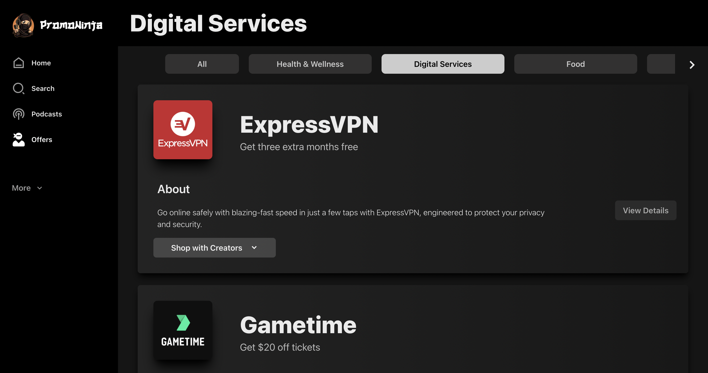
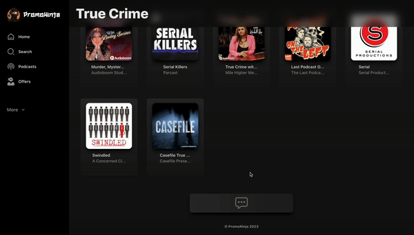
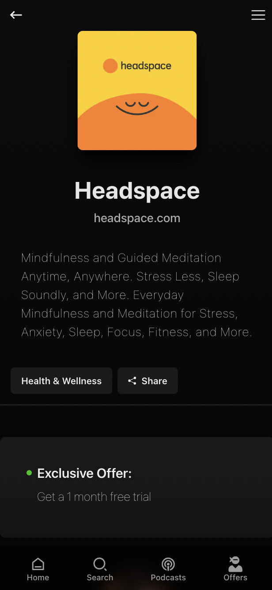

  

# PromoNinja

Live Site: [promoninja.io
](https://promoninja.io)

**Note: For deployment purposes, the original project repository was split into this current client repo and the backend, which is available here: https://github.com/amarixdev/promoninja-BE**

PromoNinja is a free platform that brings together podcast creators, listeners, and sponsors. It simplifies sponsorship management for creators, provides exclusive promotions for listeners, and offers increased reach for sponsors. It's an all in one application for anyone who enjoys podcasts and saving money.

- [PromoNinja](#promoninja)
  - [FAQ](#faq)
      - [Why did I build this?](#why-did-i-build-this)
  - [Features](#features)
    - [Search your favorite podcast or sponsor](#search-your-favorite-podcast-or-sponsor)
    - [**Responsive Layout, Mobile Optimized**](#responsive-layout-mobile-optimized)
    - [**Community Inputs**](#community-inputs)
    - [**Pre-rendered Pages**](#pre-rendered-pages)
  - [Accessibility Considerations](#accessibility-considerations)
  - [Tech Stack](#tech-stack)
  - [Future Plans](#future-plans)
- [Custom Content-Management System](#custom-content-management-system)
  - [Key Features](#key-features)
    - [**Color Extractor**](#color-extractor)
  - [Tech Stack](#tech-stack-1)
  - [Future Plans](#future-plans-1)
- [Backend](#backend)
  - [Tech Stack](#tech-stack-2)
  - [GraphQL API](#graphql-api)
    - [Queries](#queries)
    - [Mutations](#mutations)
    - [Podcast](#podcast)
    - [Sponsor](#sponsor)

## FAQ

#### Why did I build this?

Sponsor affiliate links are the most common way podcasts generate income. I noticed several podcasts had sponsors in common, so I came up with the idea to support multiple shows simultaneously. As a software developer and avid podcast listener, I felt happy to repay the podcasting community for the countless hours of entertainment.

## Features

### Search your favorite podcast or sponsor

### **Responsive Layout, Mobile Optimized**

_Podcast Page_

_Offers Page_

### **Community Inputs**

**Reccomendations**: _Users can reccomend their favorite podcasts and sponsors to be added to the platform._

**Report Issue**: _Users can report broken affiliate links; this helps PromoNinja stay up-to-date_

### **Pre-rendered Pages**

Pages are pre-rendered with GetStaticProps so that they are available immediately when the user visits it. This improves the performance of the app by reducing the number of requests that need to be made to the server.

**Other Features**

- Sponsor previews - _Desktop only_
- Load More pagination
- Easter Eggs
- Color-extracted UI

## Accessibility Considerations

_Visual - Ninja (Night) Mode_

---

_Visual - Screen Reader compatible_

_Cognitive - User-friendly navigation_

## Tech Stack

- Apollo GraphQL (client)
- NextJS + Typescript
- TailwindCSS

## Future Plans

- Add meta tags for improved searchability
- Add sub-categories to podcasts

# Custom Content-Management System

Explored different Headless CMS solutions, such as Sanity.io and Payload CMS, before deciding to create my own to better fit the needs of PromoNinja. The code is available to view here: **https://github.com/amarixdev/promoninja-CMS**

## Key Features

### **Color Extractor**

**Other Features**

- Spotify API integration
- Create Sponsors and Podcasts
- Delete Sponsors and Podcasts
- Update Categories
- Edit Promotions and Affiliate Links

## Tech Stack

- Apollo GraphQL (client)
- NextJS + Typescript
- TailwindCSS

## Future Plans

- Mobile optimization
- Refactor code base for readability

# Backend

Code: **https://github.com/amarixdev/promoninja-BE**

## Tech Stack

- Apollo GraphQL (server)
- NodeJS
- Prisma ORM
- MongoDB

## GraphQL API

### Queries

### Mutations

### Podcast

### Sponsor

Full Schema available here: **https://github.com/amarixdev/promoninja-BE/blob/main/backend/src/graphql/typeDefs.ts**